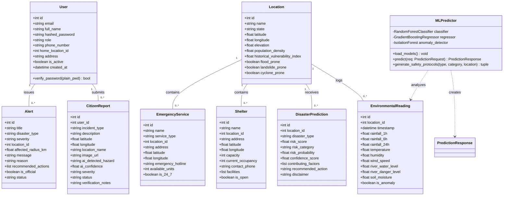

# CivicPulse — Class Diagram

```mermaid
classDiagram
    class User {
        +int id
        +string email
        +string full_name
        +string hashed_password
        +string role
        +string phone_number
        +int home_location_id
        +string address
        +boolean is_active
        +datetime created_at
        +verify_password(plain_pwd) bool
    }

    class Location {
        +int id
        +string name
        +string state
        +float latitude
        +float longitude
        +float elevation
        +float population_density
        +float historical_vulnerability_index
        +boolean flood_prone
        +boolean landslide_prone
        +boolean cyclone_prone
    }

    class EnvironmentalReading {
        +int id
        +int location_id
        +datetime timestamp
        +float rainfall_1h
        +float rainfall_6h
        +float rainfall_24h
        +float temperature
        +float humidity
        +float wind_speed
        +float river_water_level
        +float river_danger_level
        +float soil_moisture
        +boolean is_anomaly
    }

    class MLPredictor {
        -RandomForestClassifier classifier
        -GradientBoostingRegressor regressor
        -IsolationForest anomaly_detector
        +load_models() void
        +predict(req: PredictionRequest) PredictionResponse
        +generate_safety_protocols(type, category, location) tuple
    }

    class DisasterPrediction {
        +int id
        +int location_id
        +string disaster_type
        +float risk_score
        +string risk_category
        +float risk_probability
        +float confidence_score
        +list contributing_factors
        +string recommended_action
        +string disclaimer
    }

    class Alert {
        +int id
        +string title
        +string disaster_type
        +string severity
        +int location_id
        +float affected_radius_km
        +string message
        +string reason
        +list recommended_actions
        +boolean is_official
        +string status
    }

    class CitizenReport {
        +int id
        +int user_id
        +string incident_type
        +string description
        +float latitude
        +float longitude
        +string location_name
        +string image_url
        +string ai_detected_hazard
        +float ai_confidence
        +string severity
        +string status
        +string verification_notes
    }

    class Shelter {
        +int id
        +string name
        +int location_id
        +string address
        +float latitude
        +float longitude
        +int capacity
        +int current_occupancy
        +string contact_phone
        +list facilities
        +boolean is_open
    }

    class EmergencyService {
        +int id
        +string name
        +string service_type
        +int location_id
        +string address
        +float latitude
        +float longitude
        +string emergency_hotline
        +int available_units
        +boolean is_24_7
    }

    User "1" -- "0..*" CitizenReport : submits
    User "1" -- "0..*" Alert : issues
    Location "1" -- "0..*" EnvironmentalReading : logs
    Location "1" -- "0..*" DisasterPrediction : receives
    Location "1" -- "0..*" Shelter : contains
    Location "1" -- "0..*" EmergencyService : contains
    MLPredictor ..> PredictionResponse : creates
    MLPredictor ..> EnvironmentalReading : analyzes
```
