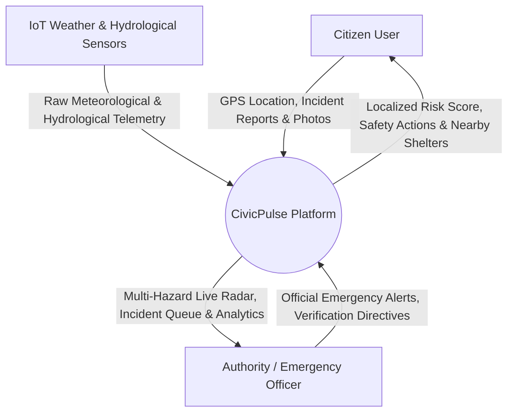
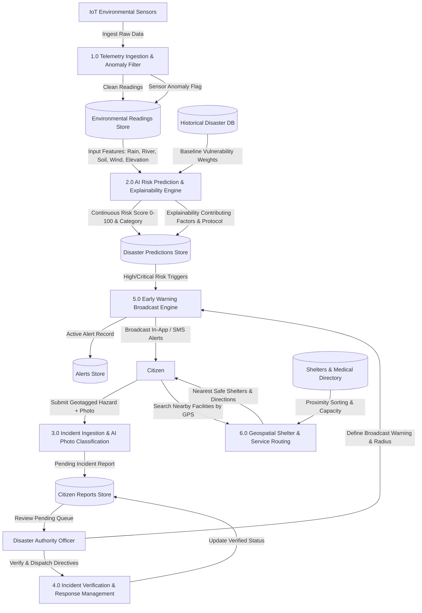

# CivicPulse — Data Flow Diagrams (DFD)

## DFD Level 0 — Context Diagram

```mermaid
graph TD
    Citizen[Citizen User]
    Admin[Authority / Emergency Officer]
    Sensors[IoT Weather & Hydrological Sensors]
    
    System((CivicPulse Platform))
    
    Sensors -->|Raw Meteorological & Hydrological Telemetry| System
    Citizen -->|GPS Location, Incident Reports & Photos| System
    System -->|Localized Risk Score, Safety Actions & Nearby Shelters| Citizen
    
    Admin -->|Official Emergency Alerts, Verification Directives| System
    System -->|Multi-Hazard Live Radar, Incident Queue & Analytics| Admin
```

---

## DFD Level 1 — Detailed Operational Data Flow

```mermaid
graph TD
    Sensors[IoT Environmental Sensors] -->|Ingest Raw Data| P1[1.0 Telemetry Ingestion & Anomaly Filter]
    P1 -->|Clean Readings| D1[(Environmental Readings Store)]
    P1 -->|Sensor Anomaly Flag| D1

    D1 -->|Input Features: Rain, River, Soil, Wind, Elevation| P2[2.0 AI Risk Prediction & Explainability Engine]
    D2[(Historical Disaster DB)] -->|Baseline Vulnerability Weights| P2
    
    P2 -->|Continuous Risk Score 0-100 & Category| D3[(Disaster Predictions Store)]
    P2 -->|Explainability Contributing Factors & Protocol| D3

    Citizen[Citizen] -->|Submit Geotagged Hazard + Photo| P3[3.0 Incident Ingestion & AI Photo Classification]
    P3 -->|Pending Incident Report| D4[(Citizen Reports Store)]

    D4 -->|Review Pending Queue| Admin[Disaster Authority Officer]
    Admin -->|Verify & Dispatch Directives| P4[4.0 Incident Verification & Response Management]
    P4 -->|Update Verified Status| D4

    Admin -->|Define Broadcast Warning & Radius| P5[5.0 Early Warning Broadcast Engine]
    D3 -->|High/Critical Risk Triggers| P5
    P5 -->|Active Alert Record| D5[(Alerts Store)]
    P5 -->|Broadcast In-App / SMS Alerts| Citizen
    
    Citizen -->|Search Nearby Facilities by GPS| P6[6.0 Geospatial Shelter & Service Routing]
    D6[(Shelters & Medical Directory)] -->|Proximity Sorting & Capacity| P6
    P6 -->|Nearest Safe Shelters & Directions| Citizen
```
