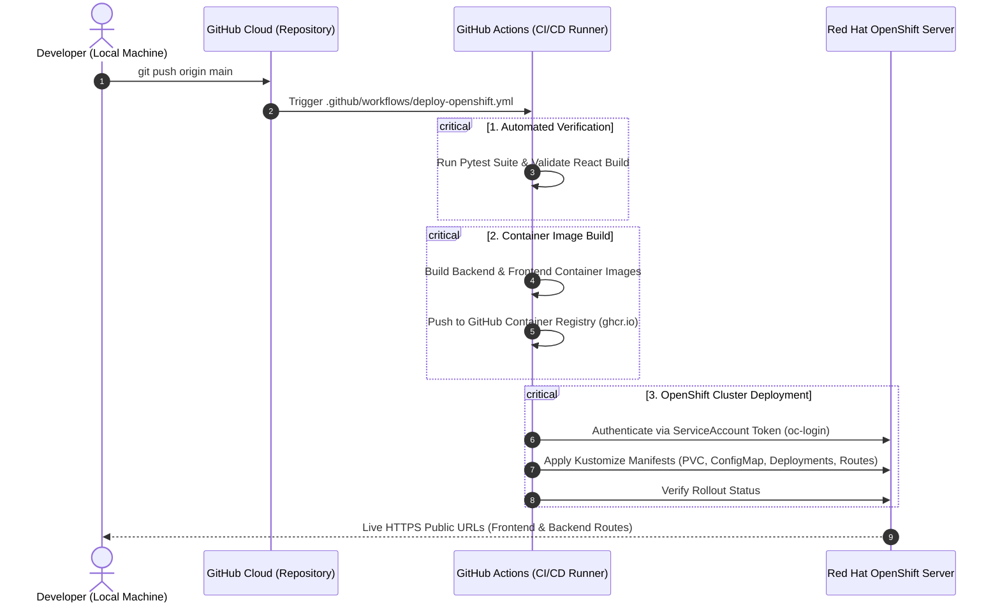

# CivicPulse — OpenShift CI/CD Cloud Deployment Guide

## Automated Deployment Flow



---

## 1. Dockerfile — Backend API

```dockerfile
FROM python:3.11-slim

WORKDIR /app

ENV PYTHONDONTWRITEBYTECODE=1 \
    PYTHONUNBUFFERED=1 \
    PYTHONPATH=/app

RUN apt-get update && apt-get install -y --no-install-recommends \
    build-essential \
    curl \
    && rm -rf /var/lib/apt/lists/*

COPY requirements.txt .
RUN pip install --no-cache-dir -r requirements.txt

COPY . .

# Train models on container build if not packaged
RUN python app/ml/train_models.py

EXPOSE 8000

CMD ["uvicorn", "app.main:app", "--host", "0.0.0.0", "--port", "8000", "--workers", "4"]
```

---

## 2. Dockerfile — Frontend Web App

```dockerfile
# Stage 1: Build React
FROM node:20-alpine AS build

WORKDIR /app
COPY package*.json ./
RUN npm install
COPY . .
RUN npm run build

# Stage 2: Serve with Nginx
FROM nginx:alpine
COPY --from=build /app/dist /usr/share/nginx/html
COPY nginx.conf /etc/nginx/conf.d/default.conf

EXPOSE 80
CMD ["nginx", "-g", "daemon off;"]
```

---

## 3. Docker Compose Configuration

```yaml
version: '3.8'

services:
  backend:
    build:
      context: ./backend
      dockerfile: Dockerfile
    ports:
      - "8000:8000"
    environment:
      - DATABASE_URL=sqlite:///./civicpulse.db
      - SECRET_KEY=production-secret-key-change-in-prod
    volumes:
      - ./backend/data:/app/data
      - ./backend/static/uploads:/app/static/uploads
    restart: always

  frontend:
    build:
      context: ./frontend
      dockerfile: Dockerfile
    ports:
      - "80:80"
    depends_on:
      - backend
    restart: always
```
