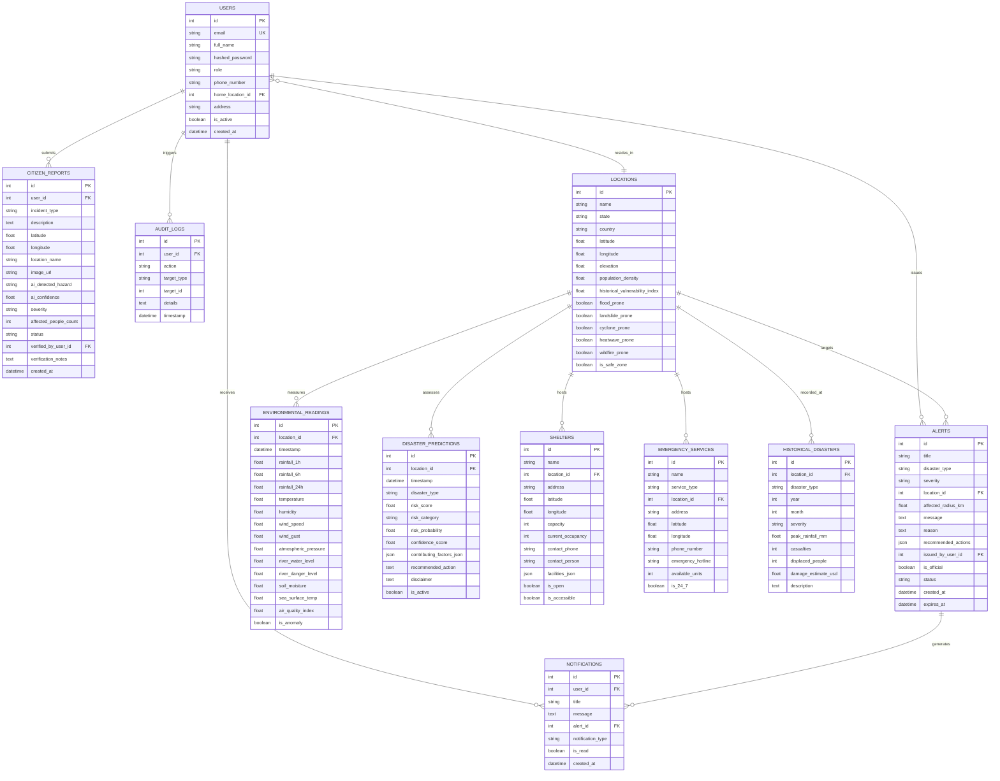

# CivicPulse — Entity-Relationship (ER) Diagram

```mermaid
erDiagram
    USERS ||--o{ CITIZEN_REPORTS : "submits"
    USERS ||--o{ ALERTS : "issues"
    USERS ||--o{ NOTIFICATIONS : "receives"
    USERS ||--o{ AUDIT_LOGS : "triggers"
    USERS }o--|| LOCATIONS : "resides_in"

    LOCATIONS ||--o{ ENVIRONMENTAL_READINGS : "measures"
    LOCATIONS ||--o{ DISASTER_PREDICTIONS : "assesses"
    LOCATIONS ||--o{ ALERTS : "targets"
    LOCATIONS ||--o{ SHELTERS : "hosts"
    LOCATIONS ||--o{ EMERGENCY_SERVICES : "hosts"
    LOCATIONS ||--o{ HISTORICAL_DISASTERS : "recorded_at"

    ALERTS ||--o{ NOTIFICATIONS : "generates"

    USERS {
        int id PK
        string email UK
        string full_name
        string hashed_password
        string role
        string phone_number
        int home_location_id FK
        string address
        boolean is_active
        datetime created_at
    }

    LOCATIONS {
        int id PK
        string name
        string state
        string country
        float latitude
        float longitude
        float elevation
        float population_density
        float historical_vulnerability_index
        boolean flood_prone
        boolean landslide_prone
        boolean cyclone_prone
        boolean heatwave_prone
        boolean wildfire_prone
        boolean is_safe_zone
    }

    ENVIRONMENTAL_READINGS {
        int id PK
        int location_id FK
        datetime timestamp
        float rainfall_1h
        float rainfall_6h
        float rainfall_24h
        float temperature
        float humidity
        float wind_speed
        float wind_gust
        float atmospheric_pressure
        float river_water_level
        float river_danger_level
        float soil_moisture
        float sea_surface_temp
        float air_quality_index
        boolean is_anomaly
    }

    DISASTER_PREDICTIONS {
        int id PK
        int location_id FK
        datetime timestamp
        string disaster_type
        float risk_score
        string risk_category
        float risk_probability
        float confidence_score
        json contributing_factors_json
        text recommended_action
        text disclaimer
        boolean is_active
    }

    ALERTS {
        int id PK
        string title
        string disaster_type
        string severity
        int location_id FK
        float affected_radius_km
        text message
        text reason
        json recommended_actions
        int issued_by_user_id FK
        boolean is_official
        string status
        datetime created_at
        datetime expires_at
    }

    CITIZEN_REPORTS {
        int id PK
        int user_id FK
        string incident_type
        text description
        float latitude
        float longitude
        string location_name
        string image_url
        string ai_detected_hazard
        float ai_confidence
        string severity
        int affected_people_count
        string status
        int verified_by_user_id FK
        text verification_notes
        datetime created_at
    }

    SHELTERS {
        int id PK
        string name
        int location_id FK
        string address
        float latitude
        float longitude
        int capacity
        int current_occupancy
        string contact_phone
        string contact_person
        json facilities_json
        boolean is_open
        boolean is_accessible
    }

    EMERGENCY_SERVICES {
        int id PK
        string name
        string service_type
        int location_id FK
        string address
        float latitude
        float longitude
        string phone_number
        string emergency_hotline
        int available_units
        boolean is_24_7
    }

    NOTIFICATIONS {
        int id PK
        int user_id FK
        string title
        text message
        int alert_id FK
        string notification_type
        boolean is_read
        datetime created_at
    }

    HISTORICAL_DISASTERS {
        int id PK
        int location_id FK
        string disaster_type
        int year
        int month
        string severity
        float peak_rainfall_mm
        int casualties
        int displaced_people
        float damage_estimate_usd
        text description
    }

    AUDIT_LOGS {
        int id PK
        int user_id FK
        string action
        string target_type
        int target_id
        text details
        datetime timestamp
    }
```
