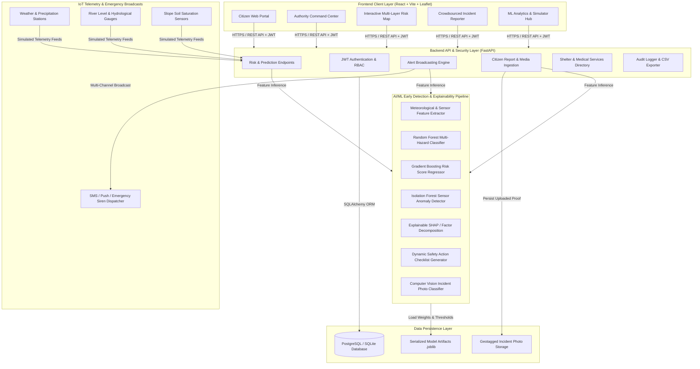

# CivicPulse — System Architecture Document

---

## Architecture Components

### 1. Presentation Layer (Frontend)
- **Framework**: React 18 + Vite with Tailwind CSS glassmorphic public safety design system.
- **Mapping & Geofencing**: Leaflet.js with dynamic SVG hazard circles, safe zones, shelters, and trauma centers.
- **Explainability Visuals**: Real-time gauge meters, feature weight breakdown bars, confusion matrices, and interactive scenario simulator.

### 2. Application & API Layer (Backend)
- **Framework**: FastAPI (Asynchronous Python 3.14).
- **Security**: PBKDF2 password hashing, JSON Web Tokens (JWT), Role-Based Access Control (`citizen`, `admin`).
- **REST Endpoints**: Modular routing for Auth, Risk Assessment, Alerts, Citizen Reports, Shelters, and Telemetry.

### 3. Artificial Intelligence & Machine Learning Pipeline
- **Classifier**: Random Forest Ensemble (120 trees) categorizing conditions into `LOW`, `MODERATE`, `HIGH`, `CRITICAL`.
- **Regressor**: Gradient Boosting Regressor computing a transparent continuous score (0–100).
- **Anomaly Detection**: `IsolationForest` detecting faulty, tampered, or sudden extreme sensor readings.
- **Explainable AI**: Deconstructs every prediction into clear human-readable factors (e.g. *“Heavy 24h rainfall of 185mm detected, river level at 4.1m nearing warning threshold”*).
- **Image Hazard Classifier**: Heuristic & computer vision analyzer categorizing crowdsourced photos into Floods, Landslides, Fires, or Fallen Trees.

### 4. Data Layer
- **Relational Storage**: Relational tables for Users, Locations, Sensor Streams, Predictions, Alerts, Reports, Shelters, Emergency Services, and Audit Logs.
- **Static Assets**: Secure directory for citizen upload proofs and serialized `.joblib` model artifacts.
